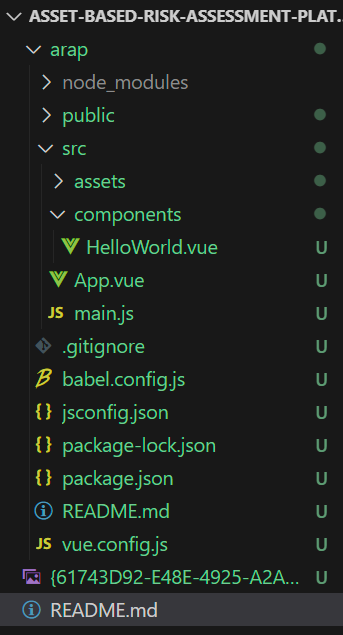
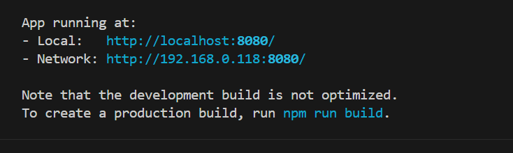

# Some bug to fix
New Asset页面：
- 1. 如果切换了问卷逻辑，原先填写的内容应该清空（比如asset type从software改成pysical或者改为空值,那么software特有的那些问卷字段应该全部清空。External Supplied Service从yes切换成no,也应该清空下面的问卷字段）
- 2.  information -- Asset Category  选择DataBase的时候，报错显示‘Information Asset category is required.’

Questionaire页面
- 1. RiskAssessment home页面点击跳转的时候进行路由选择和参数传输（正在修）
- 2. save 和done的后端逻辑(正在修)
- 3. 一些问题旁边需要有帮助信息（具体参考excel），有个小问号的图标（图标代码参考https://element-plus.sxtxhy.com/zh-CN/component/icon.html），鼠标悬停的时候显示这个问题的具体解释
- 4. 点击back按钮应该是回到上一个打开的页面，back按钮位置往右调整，不要贴着屏幕边
- 5. 保存之后 进行路由跳转应该不会提示。只有有修改且未保存的时候才会在路由跳转的时候出现提示
- 6. 标题修改：修改标题为Questionaire for [assetname]。标题字号调大，问卷内容和标题之间加一点间距

Evidence Chain页面：
- 1. （可选）给对应的 Asset 分配 auditor 后，增加一个 AuditProject 在淡黄色详情表中。目前只能看到该asset 已分配到某个auditorProject中，但不知道具体分配在哪一个auditProject中。如果auditorProject数量一多，就不知道要去那里remove。

EvidenceChainDetail页面
- 1. Risk Assessment -- Identified Risks -- 是否在完成Questionnaire后，就能显示risk内容 （目前risk_relationship有对应的riskType 但该区域无内容显示)
- 2. 返回时，需返回上一个页面。

Sub Risk Management页面
- 1. Mark as Complete 改成 Done

Audit Detail页面
- 1. Remove: （目前删除之后，数据库里的数据并没有被删除。刷新一下就又有显示了）。点击Remove后需要整个记录删除。

Help按钮，直接放最后一版require文档得了

# Asset-based-Risk-Assessment-Platform-Frontend
HKU CS project proposal

## HOW TO DOWNLOAD AND USE
### Down load
打开Command Prompt,定位到想要放置的文件夹位置，运行
```
git clone https://github.com/Lillian-7798/Asset-based-Risk-Assessment-Platform-Frontend.git
```

### Use
本项目使用Vue3构建的项目，在运行之前需要先完成node.js和vue的安装配置，本人使用版本如下：

> node: v20.17.0

> @vue/cli 5.0.8

node.js可以用
```
node -v
```
命令来测试是否已经安装，安装教程可以参考：https://www.cnblogs.com/matanzhang/p/11441693.html


Vue可以用
```
Vue -version
```
Vue安装参考：https://cli.vuejs.org/zh/guide/installation.html

### Run
首先查看当前文件夹内是否存在node_modules文件夹，如下图：

如果不存在，需要执行
```
npm install
```

每次运行需要在Command Prompt中执行以下命令
```
cd arap
npm run serve
```
会出现如下情况：

复制地址在浏览器打开即可，记得不要删除当前terminal

## *[Important]* How to Push
! 不要把node_modules上传到github仓库

！如果有新增加插件/组件库，确保push了package.json文件，并且push之后在群里提醒大家下次运行前更新（删除node_modules文件夹，重新npm install就可以）

！push前可以选择新建一条分支上传之后处理冲突并且合并分支，或者push前先pull,在本地处理冲突后再上传。一定要再上传之前检查好本地代码是否是仓库代码的最新版本！不然仓库回滚起来比较麻烦。

（git pull/push命令简单介绍）
> git clone [url]: 克隆远程仓库到本地

> 在本地仓库文件夹下执行 git pull: 拉取远程仓库的最新版本到本地仓库

> git status: 查看仓库当前状态，显示你上次提交之后哪些文件存在更改、

> git add .: 添加当前目录下所有文件到暂存区

> git add [file] :添加指定文件到暂存区

> git commit -m "[message]" :提交暂存区的更改到本地仓库， [message]是提交附带的留言

> git push: 上传本地仓库的版本代码到远程仓库

## Dependence:
使用了element-plus组件库方便开发，参考 https://element-plus.org/zh-CN/component/overview.html

## How to write
访问网址的路由在arap/src/router/index.js中，默认访问/会跳转到/Login页面

网站的所有页面在arap/src/pages中，每个页面新建一个folder, 新建页面需要将其添加在router/index.js中，渲染页面=渲染该页面文件夹下的index.vue。可以通过修改index.vue文件达到修改页面的目的。

arap/src/components下有网站的Footer和Header。
